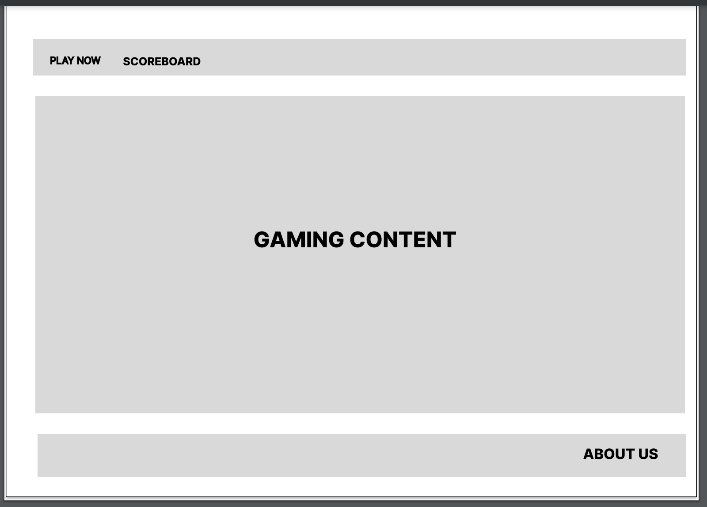

# Project-Bang

## Creators

  Alejandra Altamirano

  Anthony Cunningham

  David Danilchik

## What is our project?

  Welcome, at the time of writing this, our application is looking to be an interactive site that the user will practice aiming with their mouse by clicking on randomly generated objects on the page. They will score points for more items clicked on. This will be purely for fun, and may adapt a new theme as we meet our goals! :D

## Wireframe

## Project Management / User Story

[User Stories](https://alejandraaltamirano47707.invisionapp.com/freehand/Untitled-mbLm7LN3G)

## Domain Modeling

User:
Properties:

UserID (String or Integer), Username (String), Email (String), Password (String), Profile Picture (URL or Blob), Contact Details (String), Preferences (JSON or String).

Target:
Properties:

TargetID (String or Integer), PositionX (Float), PositionY (Float), Size (Float), Type (String or Enum).

PracticeSession:
Properties:

 SessionID (String or Integer), UserID (Foreign Key to User), StartTimestamp (Datetime), EndTimestamp (Datetime).

Challenge:
Properties:

ChallengeID (String or Integer), Name (String), Description (String), TimeLimit (Integer).

Score:
Properties:

ScoreID (String or Integer), UserID (Foreign Key to User), SessionID (Foreign Key to PracticeSession), ChallengeID (Foreign Key to Challenge), Points (Integer), Timestamp (Datetime).
